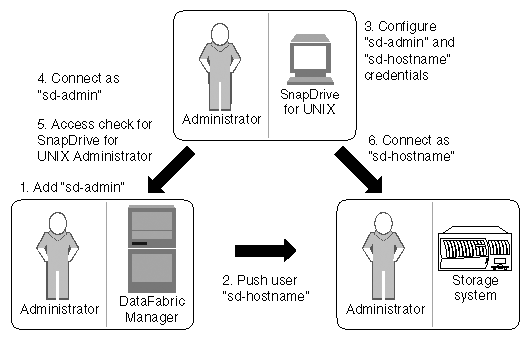

= SnapDrive for UNIX and Operations Manager console interaction
:icons: font
:imagesdir: ../media/

[.lead]
Use of Role-based access control (RBAC) depends on the Operations Manager console infrastructure. The Operations Manager console administrator must create user names for SnapDrive for UNIX use. All storage operation requests are first sent to Operations Manager console for an access check. After Operations Manager console verifies a storage operation from a specific SnapDrive user, the operation is completed.

The following diagram illustrates the entire RBAC for storage operations.

. Operations Manager console administrator adds sd-admin user on Operations Manager console.
. Operations Manager console administrator creates sd-hostname user on the storage system.
. Operations Manager console administrator sends sd-admin and sd-hostname credentials to SnapDrive for UNIX administrator.
. SnapDrive administrator configures SnapDrive with the received user credentials.
. Operations Manager console performs access check for SnapDrive for UNIX use with the user credentials added by SnapDrive administrator.
. After the SnapDrive user is authenticated, the user can connect to the storage system.

When a SnapDrive user wants to carry out some storage operation, the user issues the corresponding command at the command line. The request is sent to Operations Manager console for an access check. Operations Manager console checks whether the requested user has the appropriate permissions to carry out the SnapDrive operation. The result of the access check is returned to SnapDrive. Depending on the result, the user is allowed or not allowed to carry out the storage operations on the storage system.

If the user is verified after the access check, the user connects to the storage system as sd-hostname.

NOTE: sd-hostname and sd-admin are the recommended user names. You can configure SnapDrive for UNIX with other user names.
